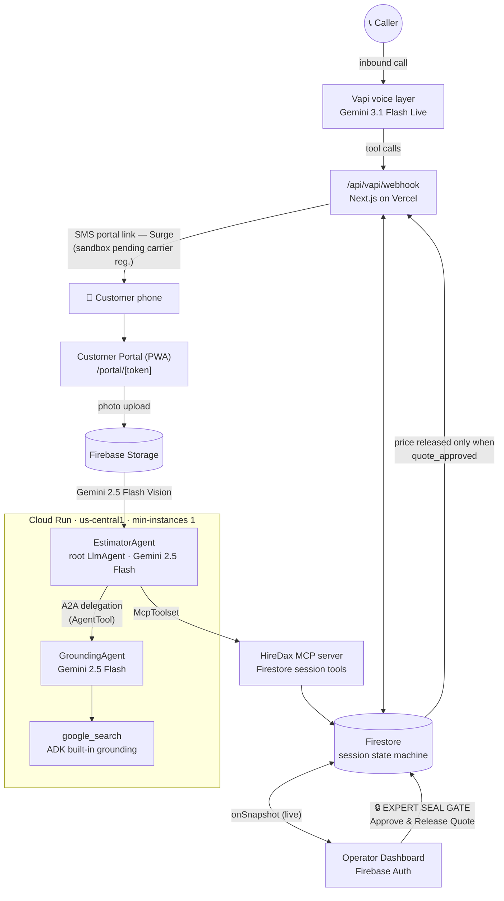
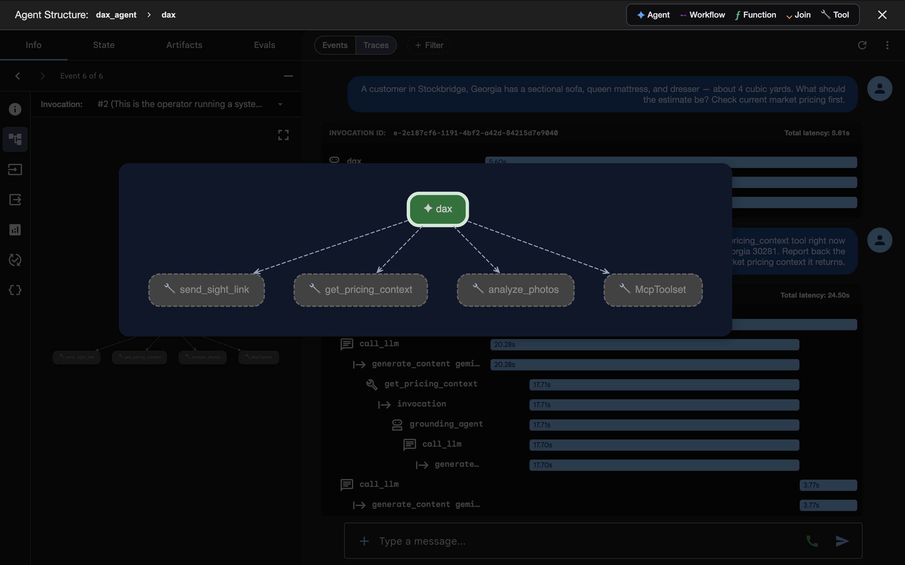
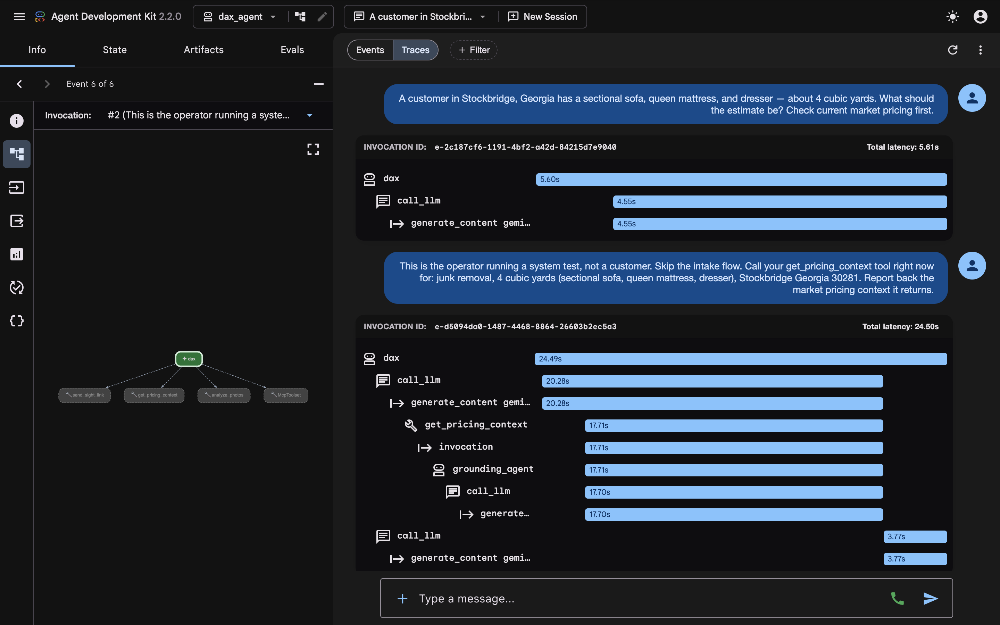
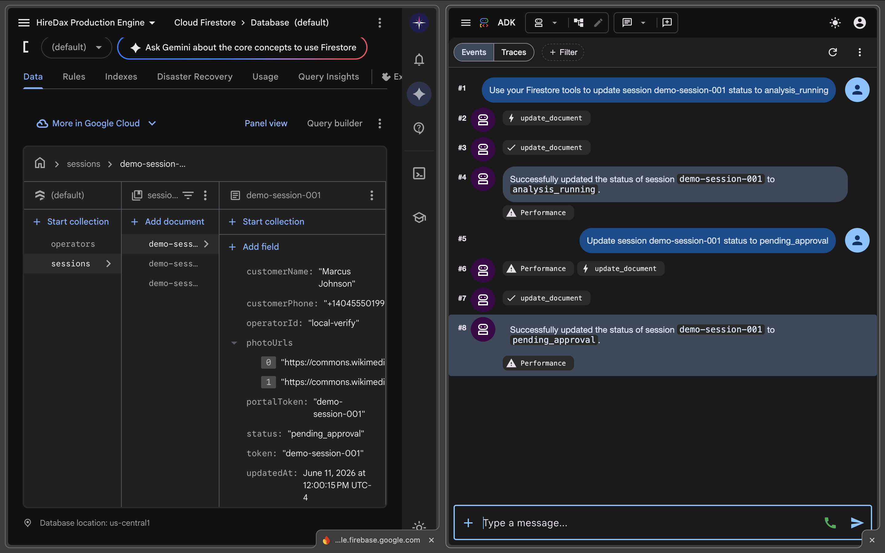

# HireDax

**HireDax** is a real-time AI voice agent and visual estimator for home-service businesses — junk removal first. Solo operators miss roughly half their inbound calls because they're on a job site with their hands full, and a missed call is usually a lost job: callers book whoever answers. HireDax answers every call instantly with **Dax**, an AI agent that talks to the customer, texts them a camera link mid-call, analyzes their photos with Gemini Vision, grounds the estimate in real-time regional pricing, and routes an itemized quote to the operator's phone for one-tap approval — turning missed calls into booked, priced jobs without the operator ever leaving the job site.

## The Golden Thread

The end-to-end flow, exactly as a real call runs:

1. A customer calls the business line. **Vapi answers instantly** with Dax (Gemini 3.1 Flash Live) — no voicemail, no hold.
2. Dax collects the customer's name and what they need hauled, then triggers **`send_sight_link`** — a session is created in Firestore and the customer receives an SMS with their personal photo-upload portal link, all while still on the call.
3. The customer opens the link (zero-install PWA) and snaps 1–3 photos of the items. Photos upload to Firebase Storage and the session advances through the state machine (`link_sent → photos_uploading → photos_complete`).
4. The **EstimatorAgent** (ADK root agent on Cloud Run) picks up the session. Before pricing anything, it **delegates to the GroundingAgent**, which pulls real-time regional junk-removal pricing via Google Search grounding.
5. The EstimatorAgent runs **Gemini 2.5 Flash Vision** over the photos, producing an itemized list, volume estimate, confidence score, and a grounded suggested price. The session moves to `pending_approval` via the HireDax MCP server.
6. The operator's dashboard **chimes** and shows the full visual breakdown — photos, items, volume, suggested price — with an editable price field.
7. 🔒 **THE EXPERT SEAL GATE:** the operator taps **Approve & Release Quote**. Only this explicit human action writes `status: "quote_approved"` to Firestore. **No price is ever spoken to a caller without operator approval** — the gate is enforced *server-side* in the voice webhook (`read_approved_quote` returns the price only when `status === "quote_approved"`), not just in the UI. This is a constitutional constraint of the system, not a feature flag.
8. Dax delivers the approved price to the caller and confirms the booking. The session continues forward-only through `quote_delivered → booking_confirmed → … → rated`.

## Architecture

- **Voice:** Gemini 3.1 Flash Live via Vapi — real-time conversational telephony with mid-call tool calling.
- **Agent LLM + Vision:** Gemini 2.5 Flash via Vertex AI — powers both agents and the photo analysis.
- **Multi-agent:** ADK 2.2 (google-adk v2.2.0) — **EstimatorAgent** (root) orchestrates the call lifecycle and Expert Seal Gate; **GroundingAgent** is wired in as an AgentTool, and the EstimatorAgent → GroundingAgent A2A delegation runs before every estimate.
- **Grounding:** ADK built-in `google_search` tool inside the GroundingAgent — real-time regional pricing, not a static price book.
- **MCP:** custom HireDax MCP server connected via `McpToolset` — the EstimatorAgent reads and writes Firestore session state (`update_document` and related tools) through MCP, round-trip verified.
- **Agent hosting:** Cloud Run (us-central1, min-instances 1 so the demo never cold-starts).
- **Frontend:** Next.js 14 App Router on Vercel.
- **Platform:** Firebase Auth (operator login), Firestore (session state machine, live dashboard via `onSnapshot`), Firebase Storage (customer photos).

## Evidence

| | |
|---|---|
|  | **Agent graph** — EstimatorAgent (root) with GroundingAgent wired in as an AgentTool, plus the MCP toolset. |
|  | **A2A delegation trace** — a live run showing EstimatorAgent handing off to GroundingAgent for grounded pricing before analysis. |
|  | **MCP round-trip verification** — the agent writing session state to Firestore through the HireDax MCP server. |

## Judge Testing Instructions

- **Live app:** https://hiredax.com
- **Login:** `demo@hiredax.com` — the password is provided in the Devpost testing notes.
- **Walkthrough:** log in → the dashboard shows live sessions from Firestore → open the **pending** session (full photo + item breakdown) → tap **✅ Approve & Release Quote** → watch the status flip to approved in real time. That tap is the Expert Seal Gate in action.
- **Talk to Dax live:** call **+1 (984) 240-2839**.
- **IMPORTANT — SMS note:** outbound SMS currently sends via a Surge **sandbox number restricted to verified devices** while toll-free carrier registration completes (registration is submitted; the carrier required our website to be live, which it now is). To experience the customer portal without SMS, use the **"Copy portal link"** action on any dashboard session card and open it in a new tab — this is the exact URL the customer receives by text.

## Findings & Learnings

- **Audit your agent instruction files before autonomous runs.** A guide-file bug — our own CLAUDE.md instructed the coding agent *not* to import the ADK SDK — nearly meant the core agent never got built. A suppressive directive in an instruction file fails silently: the agent just quietly routes around the work.
- **The installed library API wins over the spec.** ADK 2.2.0 renamed the MCP classes our design doc referenced. Verifying the actually-installed imports first, before writing any integration code, saved hours of debugging against documentation that no longer matched reality.
- **Firestore production-mode rules silently deny all client reads.** Auth working perfectly while every Firestore listener failed was the tell — there's no loud error, just empty snapshots. If login succeeds but data never arrives, check the rules first.
- **Org security policy blocked service-account key downloads** — and using Application Default Credentials end-to-end turned out to be the cleaner architecture anyway: no key files to manage, leak, or rotate.
- **Real-world SMS is gated by carrier registration timelines, not code.** Toll-free verification takes days and required a live website we didn't have yet. We shipped a sandbox path plus an in-product fallback (Copy Portal Link) rather than faking it.

## Third-Party Services

- **Vapi** — voice/telephony layer
- **Surge.app** — SMS delivery
- **Vercel** — frontend hosting
- **Firebase** — auth, database, storage

All other intelligence and infrastructure is Google: **Gemini** (3.1 Flash Live, 2.5 Flash, 2.5 Flash Vision), **ADK**, **Cloud Run**, and **Vertex AI**.

## Roadmap (V2)

- **Autonomous mode within operator guardrails** — Dax auto-approves quotes inside operator-set price bands; the Expert Seal Gate remains for everything outside them.
- **Vertex AI Search over operator pricing docs** — ground estimates in each operator's own historical invoices and price sheets, layered on top of Google Search grounding.
- **Multi-vertical expansion** — the call → photos → grounded estimate → human seal loop generalizes to landscaping, pressure washing, moving, and beyond.
